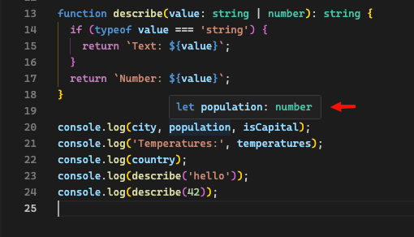

# Type System: Primitives, Arrays, Objects, and Unions

## Primitives

JavaScript has several primitive types. You use them every day, even if you don't think about them explicitly:

- `string` — text values like `'Aisha'` or `"hello"`
- `number` — integers and decimals: `27`, `3.14`, `-1`
- `boolean` — `true` or `false`
- `null` — intentionally empty
- `undefined` — not yet assigned

In JavaScript, values have these types at runtime, but you never write them down. This is perfectly valid JavaScript:

```js
let name = 'Aisha';
let age = 27;
let isStudent = true;
```

JavaScript also doesn't stop you from changing a variable's type during its lifetime. You can start with a number and reassign it to a string — no error, no warning:

```js
let age = 27;
age = 'twenty-seven'; // JavaScript allows this — no complaint
```

This flexibility is a common source of bugs. Code that expects `age` to be a number might break when it's suddenly a string — and you won't find out until the code runs.

TypeScript solves this with **type annotations**. An annotation is the `: type` you add after a variable name — a colon followed by the type. It locks the variable to that type for its entire lifetime:

```ts
let name: string = 'Aisha';
let age: number = 27;
let isStudent: boolean = true;
```

The `: string`, `: number`, and `: boolean` parts are the annotations. They are not JavaScript — they exist purely for TypeScript's type checker and your editor. When the code runs, they are stripped away and you're left with the plain JavaScript you started with.

If you try to assign the wrong type, TypeScript stops you before the code runs:

```ts
let age: number = 27;
age = 'twenty-seven'; // Error: Type 'string' is not assignable to type 'number'
```

## Arrays

Arrays are typed by what they contain. The annotation `number[]` means "an array of numbers" — every element must be a `number`. Likewise, `string[]` means every element must be a `string`:

```ts
let scores: number[] = [85, 92, 78];
let names: string[] = ['Aisha', 'Ben', 'Carlos'];
```

You can also write this with the generic syntax `Array<number>`, which means the same thing. You'll see both in the wild.

```ts
let scores: Array<number> = [85, 92, 78];
```

## Objects

You can describe the shape of an object inline. The annotation after the colon lists each property and its type, separated by semicolons:

```ts
let student: { name: string; age: number } = {
  name: 'Aisha',
  age: 27,
};
```

Here, `{ name: string; age: number }` is the type annotation. It says this object must have a `name` property that is a `string` and an `age` property that is a `number`. If you misspell a property or use the wrong type, TypeScript will flag it.

This inline style gets verbose quickly — you'll soon want interfaces or type aliases (covered in the next section) to name these shapes and reuse them.

## Unions

A union type says "this value can be one of several types." You write it with the `|` (pipe) operator between the types:

```ts
let id: string | number = 'abc-123';
id = 42; // also fine
```

The annotation `: string | number` means `id` can hold either a `string` or a `number` — both assignments above are valid.

Unions are everywhere in real code. A function might return a value or `null`. An API field might be a string or a number. Unions let you model this honestly:

```ts
function findStudent(id: number, students: { id: number; name: string }[]): { id: number; name: string } | undefined {
  return students.find((s) => s.id === id);
}
```

Here the return type `{ id: number; name: string } | undefined` tells callers that this function might not find a match — they'll need to handle the `undefined` case before using the result.

When you use a union value, TypeScript forces you to handle each possibility before using type-specific operations. This is called **narrowing** and is covered later under type guards.

## Your Editor Is Part of the Experience

For this first exercise, try typing the code into a `.ts` file in VS Code rather than copying it. VS Code has built-in TypeScript support and gives you real-time feedback without running anything:

- **Hover** over any variable, function, or expression to see its type in a tooltip.

  

- **Autocomplete** suggests properties and methods based on the type, so you don't have to memorize APIs.
- **Error squiggles** appear under code with type errors, with an explanation when you hover over them.

This instant feedback loop is one of the biggest practical benefits of TypeScript. You'll see types, catch mistakes, and discover available methods — all without leaving your editor.

> **Hands on:** Declare variables with explicit types, create an object with a typed shape, and write a function that accepts a union parameter.

<details>
<summary>Show code</summary>

Save the code below as `basics.ts` and run it with `node basics.ts`.

```ts
let city: string = 'Amsterdam';
let population: number = 905_234;
let isCapital: boolean = true;

let temperatures: number[] = [14, 16, 19, 22, 18];

let country: { name: string; continent: string; population: number } = {
  name: 'Netherlands',
  continent: 'Europe',
  population: 17_900_000,
};

function describe(value: string | number): string {
  if (typeof value === 'string') {
    return `Text: ${value}`;
  }
  return `Number: ${value}`;
}

console.log(city, population, isCapital);
console.log('Temperatures:', temperatures);
console.log(country);
console.log(describe('hello'));
console.log(describe(42));
```

Try changing `population` to a string like `"nine hundred thousand"` — TypeScript will catch the type mismatch before the code runs.

</details>
